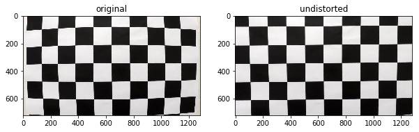
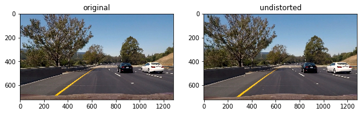
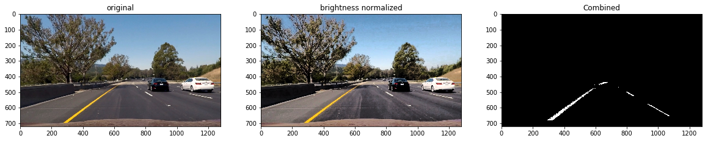
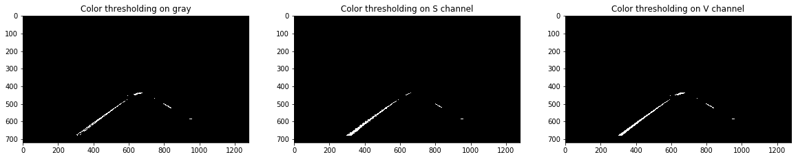
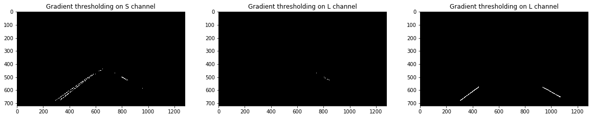
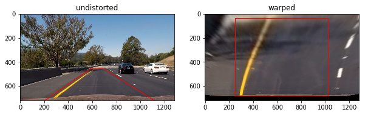
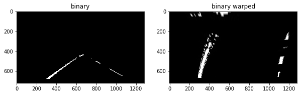
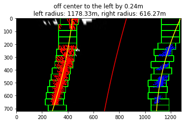
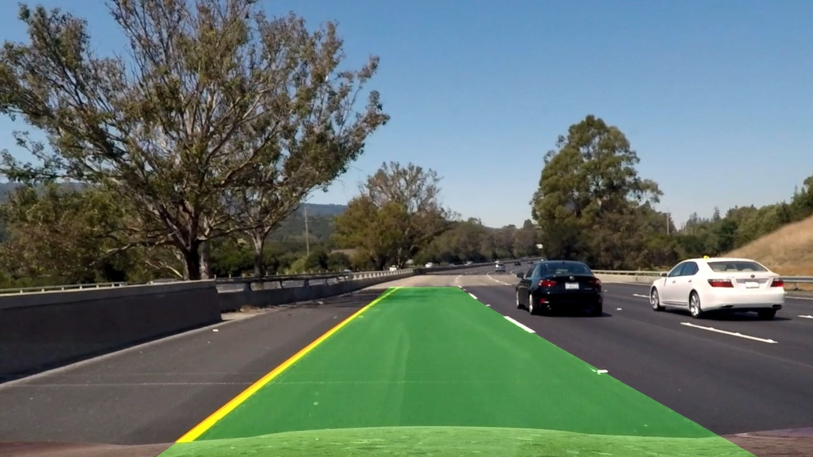
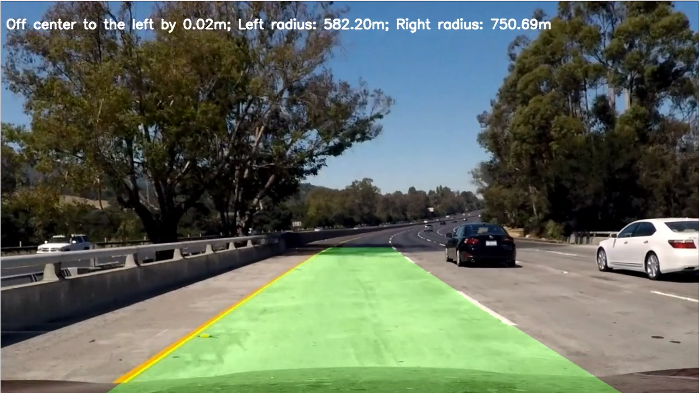

# Advanced Lane Finding Project #

The goals / steps of this project are the following:

* Compute the camera calibration matrix and distortion coefficients given a set of chessboard images.
* Apply a distortion correction to raw images.
* Use color transforms, gradients, etc., to create a thresholded binary image.
* Apply a perspective transform to rectify binary image ("birds-eye view").
* Detect lane pixels and fit to find the lane boundary.
* Determine the curvature of the lane and vehicle position with respect to center.
* Warp the detected lane boundaries back onto the original image.
* Output visual display of the lane boundaries and numerical estimation of lane curvature and vehicle position.


## [Rubric](https://review.udacity.com/#!/rubrics/571/view) Points

Here I will consider the rubric points individually and describe how I addressed each point in my implementation.  

---

### Writeup / README

#### 1. Provide a Writeup / README that includes all the rubric points and how you addressed each one.  You can submit your writeup as markdown or pdf.  [Here](https://github.com/udacity/CarND-Advanced-Lane-Lines/blob/master/writeup_template.md) is a template writeup for this project you can use as a guide and a starting point.  

You're reading it!

### Camera Calibration

#### 1. Briefly state how you computed the camera matrix and distortion coefficients. Provide an example of a distortion corrected calibration image.

The code for this step is contained in the Camera Calibration section of the IPython notebook located in [advanced-lane-finding.ipynb](advanced-lane-finding.ipynb)

I start by preparing "object points", which will be the (x, y, z) coordinates of the chessboard corners in the world. 
Here I am assuming the chessboard is fixed on the (x, y) plane at z=0, such that the object points are the same for each calibration image. 
Thus, `objp` is just a replicated array of coordinates, and `objpoints` will be appended with a copy of it every time I successfully detect all chessboard corners in a test image. 
`imgpoints` will be appended with the (x, y) pixel position of each of the corners in the image plane with each successful chessboard detection.  

I then used the output `objpoints` and `imgpoints` to compute the camera calibration and distortion coefficients using the `cv2.calibrateCamera()` function.  
I applied this distortion correction to the test image using the `cv2.undistort()` function and obtained this result: 



### Pipeline (single images)

#### 1. Provide an example of a distortion-corrected image.

To demonstrate this step, I will describe how I apply the distortion correction to one of the test images like this one:


#### 2. Describe how (and identify where in your code) you used color transforms, gradients or other methods to create a thresholded binary image.  Provide an example of a binary image result.

I used a combination of color and gradient thresholds to generate a binary image. Below is a detailed description.

I first normalize the brightness of the images, using histogram equalization on the V channel in HSV color space.

```python
    hsv = cv2.cvtColor(img, cv2.COLOR_BGR2HSV)
    hsv[:,:,2] = cv2.equalizeHist(np.uint8(hsv[:,:,2]))
    img = cv2.cvtColor(hsv, cv2.COLOR_HSV2BGR)
```

Then, I converted the RGB images to a few different color spaces (HSV, HLS and grayscale):

```python
    hls = cv2.cvtColor(img, cv2.COLOR_BGR2HLS).astype(np.float)
    hsv = cv2.cvtColor(img, cv2.COLOR_BGR2HSV).astype(np.float)
    gray = cv2.cvtColor(img, cv2.COLOR_BGR2GRAY).astype(np.float)
```
    
For color thresholding, I set different upper and lower thresholds for 3 color channels (grayscale, S in HLS and V in HSV)

````python
    # color thresholding
    color_binary = []
   
    # using gray
    cb = np.zeros_like(gray)
    cb_thresh = (200, 255)
    cb[(gray >= cb_thresh[0]) & (gray <= cb_thresh[1])] = 1
    color_binary.append(cb)
    
    # using s
    cb = np.zeros_like(gray)
    cb_thresh = (160, 255)
    cb[(hls[:,:,2] >= cb_thresh[0]) & (hls[:,:,2] <= cb_thresh[1])] = 1
    color_binary.append(cb)
    
    # using v
    cb = np.zeros_like(gray)
    cb_thresh = (210, 255)
    cb[(hsv[:,:,2] >= cb_thresh[0]) & (hsv[:,:,2] <= cb_thresh[1])] = 1
    color_binary.append(cb)
    
    color_binary = np.stack(color_binary, axis=2) *255
````

For gradient thresholding, I used x-direction Sobel operation with kernel size of 3 on two color channels (S and L of HLS space).

```python
    sbx_binary = []
    
    # using s
    sbx = np.zeros_like(gray)
    sobelx = cv2.Sobel(hls[:,:,2], cv2.CV_64F, 1, 0, ksize=sobel_ksize) 
    sobelx = np.absolute(sobelx)
    sobelx = np.uint8(255*sobelx/np.max(sobelx))   
    sx_thresh=(40, 255)
    sbx[(sobelx >= sx_thresh[0]) & (sobelx <= sx_thresh[1])] = 1
    sbx_binary.append(sbx)
    
    # using l
    sbx = np.zeros_like(gray)
    sobelx = cv2.Sobel(hls[:,:,1], cv2.CV_64F, 1, 0, ksize=sobel_ksize) 
    sobelx = np.absolute(sobelx)
    sobelx = np.uint8(255*sobelx/np.max(sobelx))   
    sx_thresh=(60, 255)
    sbx[(sobelx >= sx_thresh[0]) & (sobelx <= sx_thresh[1])] = 1
    sbx_binary.append(sbx)
```

In addition, I added a channel using Hough line detection (siimlar to the first lane finding project)

```python
    # using hough
    if use_hough:
        #img_blur = gaussian_blur(hsv[:,:,2], params.kernel_size)
        img_blur = gaussian_blur(color_binary[:,:,2], params.kernel_size)
        img_canny = canny(np.uint8(img_blur), params.low_threshold, params.high_threshold)
        masked_canny = region_of_interest(img_canny, vertices)
        line_img = hough_lines(masked_canny, params.rho, params.theta, params.threshold, params.min_line_len, params.max_line_gap)
        sbx_binary.append(line_img)
```

Finally, I combined all the above 6 channels using logical OR.

The following figure shows the original image (left), the brightness adjusted image (center) and final result of the combined binary image of the lane (right)



The intermediate results of color and gradiant thresholding as well as Hough line points are shown below






#### 3. Describe how (and identify where in your code) you performed a perspective transform and provide an example of a transformed image.

The code for my perspective transform is in Perspective Transform section of [advanced-lane-finding.ipynb](advanced-lane-finding.ipynb).

The source and destination points are defined as follows:

```python
    src = np.array([[imshape[1]*0.16, imshape[0]*1.0], [imshape[1]*0.46, imshape[0]*0.63],
                    [imshape[1]*0.54, imshape[0]*0.63], [imshape[1]*0.87, imshape[0]*1.0]], dtype=np.int32)

    dst = np.array([[imshape[1]*0.2, imshape[0]*0.95], [imshape[1]*0.2, imshape[0]*0.05],
                    [imshape[1]*0.8, imshape[0]*0.05], [imshape[1]*0.8, imshape[0]*0.95]], dtype=np.int32)
```

I verified that my perspective transform was working as expected by drawing the `src` and `dst` points onto a test image and its warped counterpart to 
verify that the lines appear parallel in the warped image.





#### 4. Describe how (and identify where in your code) you identified lane-line pixels and fit their positions with a polynomial?
#### 5. Describe how (and identify where in your code) you calculated the radius of curvature of the lane and the position of the vehicle with respect to center.
#### 6. Provide an example image of your result plotted back down onto the road such that the lane area is identified clearly.

The lane pixel identification and fitting is done in section Find lanes in [advanced-lane-finding.ipynb](advanced-lane-finding.ipynb).

The fitted result of the above warped binary image is shown below with center offset and lane curvature radius calculated and labaled in the figure title.



The fitted line and marked area is then trasformed back using the inverse perspective transformation matrix. 



The folder [output_images](output_images) contains the intermediate and final results of each of the test iamges, here is a list of what each sub-folder contains

* [output_images/undistort](output_images/undistort): undistorted test images
* [output_images/binary](output_images/binary): binary images from undistorted images
* [output_images/binary_warped](output_images/binary_warped): warped binary images
* [output_images/warped](output_images/warped): warped undistorted images
* [output_images/lane_labeled](output_images/lane_labeled): images with lane fitted and labeled in warped perspective (bird-eye view)
* [output_images/lane_labeled_unwarped](output_images/lane_labeled_unwarped): the above set of images projected back to normal view 

Note that in the test_images folder I have added frames from the challenge_video.mp4 and harder_challenge_video.mp4 for debugging purposes. The original set of test images are

* straight_line1.jpg
* straight_line2.jpg
* test1.jpg
* test2.jpg
* test3.jpg
* test4.jpg
* test5.jpg
* test6.jpg

---

### Pipeline (video)

#### 1. Provide a link to your final video output.  Your pipeline should perform reasonably well on the entire project video (wobbly lines are ok but no catastrophic failures that would cause the car to drive off the road!).

Here's a [link to my video result](./project_video_output.mp4)

Here is a screenshot



---

### Discussion

#### 1. Briefly discuss any problems / issues you faced in your implementation of this project.  Where will your pipeline likely fail?  What could you do to make it more robust?

The tips and tricks section in the lecture is very helpful. I implemented some of them. 

For example, in processing the videos, I would first do a sanity check of the result from previous frame

````python
    # sanity check
    left_sanity_check_pass = True
    right_sanity_check_pass = True
    if leftlane.detected:
        # print(leftlane.line_base_pos)
        if img.shape[0]*0.0 < leftlane.line_base_pos < img.shape[0]*.4:
            left_sanity_check_pass = False
    
    if rightlane.detected:
        if img.shape[0]*.6 < rightlane.line_base_pos < img.shape[0]:
            right_sanity_check_pass = False    
    
    leftlane_use_existing_fit = False
    if leftlane.detected and left_sanity_check_pass:
        leftlane_use_existing_fit = True
    
    rightlane_use_existing_fit = False
    if rightlane.detected and right_sanity_check_pass:
        rightlane_use_existing_fit = True
````

If sanity check passes, the program would use the existing fit, which is the average of the last 5 fit results, the relevant code snippets are listed below:

````python
    if leftlane_use_existing_fit:
        left_fit = leftlane.best_fit
        left_lane_inds = ((nonzerox > (left_fit[0]*(nonzeroy**2) + left_fit[1]*nonzeroy + left_fit[2] - margin)) & (nonzerox < (left_fit[0]*(nonzeroy**2) + left_fit[1]*nonzeroy + left_fit[2] + margin))) 
    if rightlane_use_existing_fit:
        right_fit = rightlane.best_fit
        right_lane_inds = ((nonzerox > (right_fit[0]*(nonzeroy**2) + right_fit[1]*nonzeroy + right_fit[2] - margin)) & (nonzerox < (right_fit[0]*(nonzeroy**2) + right_fit[1]*nonzeroy + right_fit[2] + margin)))  
````

and

````python
    # record fit in Line class
    leftlane.detected = True
    rightlane.detected = True
    leftlane.current_fit = left_fit
    rightlane.current_fit = right_fit
    leftlane.last_N_fit.append(left_fit)
    rightlane.last_N_fit.append(right_fit)
    if len(leftlane.last_N_fit) > leftlane.keep_N_fit:
        leftlane.last_N_fit.pop(0)
    if len(rightlane.last_N_fit) > rightlane.keep_N_fit:
        rightlane.last_N_fit.pop(0)
    
    leftlane.best_fit = np.mean(leftlane.last_N_fit, axis=0)
    rightlane.best_fit = np.mean(rightlane.last_N_fit, axis=0)
````

I find the section of finding lane pixels is the most critical one, that's why I used 6 channels (5 with thresholding on color and gradients, 1 from Hough line detection) to help make the lane pixel detection more robust. 
It worked well on the project_video.mp4, but still not very well on challenge_video.mp4 and especially on harder_challenge_video.mp4.
 
If I were to spend more effort, I would like to investigate the following:
* How to correct the image brightness and contrast better and more adaptively?
* How to set the thresholds dynamically/adaptively?
* Does it work better to project perspective to bird-eye view first before doing lane pixel detection?
* Incorporate knowledge of physical dimensions to have a better initial guess and more strict sanity check of lane location and lane distance

 
